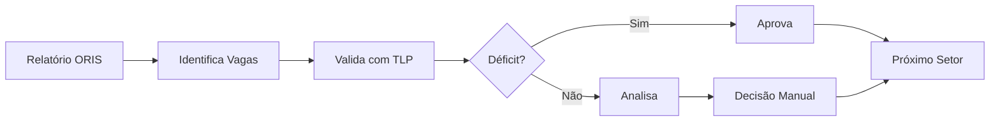

# 📋 Sistema ORIS - Módulo Cargos e Salários

[](https://www.python.org/downloads/)
[](https://streamlit.io/)
[](https://www.sqlite.org/)
[](https://claude.ai/chat/1f384158-8f38-44a2-96bd-ef1e10ca8938)

Sistema de gestão e aprovação de vagas para o setor de Cargos e Salários, com análise automática de déficit baseada em TLP (Tabela de Lotação Prevista).


---

## 📑 Índice

* [Sobre o Projeto](https://claude.ai/chat/1f384158-8f38-44a2-96bd-ef1e10ca8938#sobre-o-projeto)
* [Funcionalidades](https://claude.ai/chat/1f384158-8f38-44a2-96bd-ef1e10ca8938#funcionalidades)
* [Tecnologias](https://claude.ai/chat/1f384158-8f38-44a2-96bd-ef1e10ca8938#tecnologias)
* [Pré-requisitos](https://claude.ai/chat/1f384158-8f38-44a2-96bd-ef1e10ca8938#pr%C3%A9-requisitos)
* [Instalação](https://claude.ai/chat/1f384158-8f38-44a2-96bd-ef1e10ca8938#instala%C3%A7%C3%A3o)
* [Uso](https://claude.ai/chat/1f384158-8f38-44a2-96bd-ef1e10ca8938#uso)
* [Estrutura do Projeto](https://claude.ai/chat/1f384158-8f38-44a2-96bd-ef1e10ca8938#estrutura-do-projeto)
* [Banco de Dados](https://claude.ai/chat/1f384158-8f38-44a2-96bd-ef1e10ca8938#banco-de-dados)
* [Regras de Negócio](https://claude.ai/chat/1f384158-8f38-44a2-96bd-ef1e10ca8938#regras-de-neg%C3%B3cio)
* [Troubleshooting](https://claude.ai/chat/1f384158-8f38-44a2-96bd-ef1e10ca8938#troubleshooting)
* [Roadmap](https://claude.ai/chat/1f384158-8f38-44a2-96bd-ef1e10ca8938#roadmap)
* [Contribuição](https://claude.ai/chat/1f384158-8f38-44a2-96bd-ef1e10ca8938#contribui%C3%A7%C3%A3o)
* [Licença](https://claude.ai/chat/1f384158-8f38-44a2-96bd-ef1e10ca8938#licen%C3%A7a)

---

## 📖 Sobre o Projeto

O **Sistema ORIS - Módulo Cargos e Salários** é uma aplicação web desenvolvida em Streamlit para automatizar o processo de aprovação de vagas geradas por demissões ou afastamentos de funcionários.

### 🎯 Objetivo

Facilitar a análise e aprovação de vagas através da validação automática com a TLP (Tabela de Lotação Prevista), garantindo que as contratações estejam alinhadas com o quadro ideal de funcionários.

### 👥 Usuários

* **Gestores de RH** - Visualizam relatórios e quadros
* **Analistas de C&S** - Aprovam/rejeitam vagas
* **Coordenadores** - Acompanham estatísticas

---

## ✨ Funcionalidades

### 📋 Aprovação de Vagas

* ✅ **Identificação Automática** de vagas por demissão ou afastamento
* ✅ **Análise com TLP** - Valida déficit de funcionários por cargo/unidade
* ✅ **Filtros Avançados** - Por tipo, unidade, data
* ✅ **Aprovação em Lote** - Aprova múltiplas vagas de uma vez
* ✅ **Histórico Completo** - Rastreabilidade de todas as decisões
* ✅ **Exportação Excel** - Relatórios formatados

### 📊 Quadro de Funcionários

* ✅ **Análise de Déficit** - Por cargo e centro de custo
* ✅ **Comparação TLP vs Real** - Identificação de gaps
* ✅ **Cargos Prioritários** - Lista ordenada por déficit
* ✅ **Visualização Detalhada** - Lista de funcionários ativos
* ✅ **Dashboard Executivo** - KPIs e métricas

### 🔍 Critérios de Identificação

**Demissões:**

* Data de Rescisão >= 01/01/2025

**Afastamentos:**

* Situação ∉ [01-ATIVO, 99-Demitido, 18-ATESTADO MÉDICO]
* Data Início Situação >= 01/01/2025
* Calcula dias de afastamento automaticamente

---

## 🛠️ Tecnologias

### Core

* **[Python 3.12+](https://www.python.org/)** - Linguagem principal
* **[Streamlit](https://streamlit.io/)** - Framework web
* **[SQLite](https://www.sqlite.org/)** - Banco de dados
* **[Pandas](https://pandas.pydata.org/)** - Análise de dados

### Bibliotecas Principais

```python
streamlit==1.28.0
pandas==2.1.0
numpy==1.25.0
openpyxl==3.1.2
xlsxwriter==3.1.9
python-dotenv==1.0.0
```

---

## 📋 Pré-requisitos

* **Python** 3.12 ou superior
* **pip** (gerenciador de pacotes Python)
* **Windows 10/11** ou **Linux**
* **4GB RAM** mínimo
* **Banco de dados** `oris.db` configurado

---

## 🚀 Instalação

### 1. Clone o repositório

```bash
git clone https://github.com/sua-empresa/oris-sistema.git
cd oris-sistema/01_cargos_salarios
```

### 2. Crie um ambiente virtual

**Windows:**

```bash
python -m venv venv
.\venv\Scripts\activate
```

**Linux/Mac:**

```bash
python3 -m venv venv
source venv/bin/activate
```

### 3. Instale as dependências

```bash
pip install -r requirements.txt
```

### 4. Configure o banco de dados

Certifique-se de que o banco `oris.db` está em:

```
C:\Scripts\Oris\data\oris.db
```

Ou configure o caminho no arquivo `.env`:

```env
DB_PATH=../data/oris.db
```

### 5. Execute a aplicação

```bash
streamlit run app.py
```

A aplicação será aberta automaticamente em `http://localhost:8501`

---

## 💻 Uso

### Interface Principal

1. **Sidebar** - Navegação entre módulos
   * 📋 Aprovação de Vagas
   * 📊 Quadro de Funcionários
2. **Filtros** - Refine sua visualização
   * Por tipo (Demissões/Afastamentos)
   * Por unidade
   * Por status
3. **Ações** - Interaja com as vagas
   * ✅ Aprovar - Confirma necessidade da vaga
   * ❌ Rejeitar - Nega abertura da vaga
   * 🔄 Desfazer - Reverte decisão

### Fluxo de Trabalho



### Atalhos de Teclado

| Atalho     | Ação             |
| ---------- | ------------------ |
| `R`      | Recarregar página |
| `Ctrl+S` | Salvar (auto)      |
| `Ctrl+E` | Exportar           |

---

## 📁 Estrutura do Projeto

```
01_cargos_salarios/
│
├── app.py                      # Aplicação principal (navegação)
├── aprovar_vaga.py             # Módulo de aprovação de vagas
├── quadro_func.py              # Módulo de análise de déficit
├── gestao_vagas.py             # Funções de gerenciamento
├── config.py                   # Configurações centralizadas
│
├── requirements.txt            # Dependências Python
├── .env.example               # Exemplo de configuração
├── .gitignore                 # Arquivos ignorados pelo git
├── README.md                  # Esta documentação
│
└── assets/                    # Recursos estáticos (futuro)
    ├── images/
    └── styles/
```

---

## 🗄️ Banco de Dados

### Localização

```
../data/oris.db
```

### Tabelas Utilizadas

#### 1️⃣ `relatorio_oris`

Dados dos funcionários do relatório mensal.

| Campo                  | Tipo | Descrição                  |
| ---------------------- | ---- | ---------------------------- |
| Nome                   | TEXT | Nome completo                |
| Cargo                  | TEXT | Cargo do funcionário        |
| Centro custo           | TEXT | Unidade/centro de custo      |
| Situação             | TEXT | Status atual (01-ATIVO, etc) |
| Nome Fantasia          | TEXT | Nome do contrato             |
| Dt Rescisão           | DATE | Data da demissão            |
| Dt Início Situação  | DATE | Data do afastamento          |
| Carga Horária Semanal | REAL | Horas semanais               |

#### 2️⃣ `tlp`

Tabela de Lotação Prevista (quadro ideal).

| Campo            | Tipo    | Descrição         |
| ---------------- | ------- | ------------------- |
| contrato         | TEXT    | Nome do contrato    |
| unidade          | TEXT    | Centro de custo     |
| cargo            | TEXT    | Cargo               |
| carga_hora       | REAL    | Carga horária      |
| quantidade_ideal | INTEGER | Quantidade prevista |

#### 3️⃣ `vagas`

Histórico de vagas aprovadas/rejeitadas.

| Campo             | Tipo     | Descrição                 |
| ----------------- | -------- | --------------------------- |
| id                | INTEGER  | Chave primária             |
| nome              | TEXT     | Nome do ex-funcionário     |
| cargo             | TEXT     | Cargo da vaga               |
| centro_custo      | TEXT     | Unidade                     |
| status            | TEXT     | pendente/aprovado/rejeitado |
| tipo_vaga         | TEXT     | demissao/afastamento        |
| data_decisao      | DATETIME | Quando foi decidido         |
| usuario_aprovador | TEXT     | Quem aprovou                |
| deficit           | INTEGER  | Déficit no momento         |

### Schema Completo

```sql
-- Ver schema.sql para detalhes completos
```

---

## 📐 Regras de Negócio

### Identificação de Vagas

#### Demissões

```python
if Dt_Rescisao >= '2025-01-01':
    criar_vaga(tipo='demissao')
```

#### Afastamentos

```python
if Situacao not in ['01-ATIVO', '99-Demitido', '18-ATESTADO MÉDICO']:
    if Dt_Inicio_Situacao >= '2025-01-01':
        criar_vaga(tipo='afastamento')
        calcular_dias_afastamento()
```

### Validação com TLP

```python
deficit = quantidade_ideal - quantidade_atual

if deficit > 0:
    status = "Aprovável"
elif deficit == 0:
    status = "Quadro Completo"
else:
    status = "Excedente"
```

### Contagem de Ativos

Considera como "ativos":

* 01-ATIVO
* 18-ATESTADO MÉDICO

Não considera:

* 99-Demitido
* Outros afastamentos

---

## 🐛 Troubleshooting

### Problema: "Banco de dados não encontrado"

**Solução:**

```bash
# Verifique se o banco existe
ls ../data/oris.db

# Se não existir, crie a estrutura
python scripts/criar_banco.py
```

### Problema: "Warnings de formato de data"

**Solução:**
A função `processar_data()` foi otimizada para formato brasileiro. Se ainda aparecer:

```python
# Em aprovar_vaga.py, certifique-se de ter:
pd.to_datetime(data_str, format='%d/%m/%Y', dayfirst=True)
```

### Problema: "Erro ao carregar dados"

**Causas possíveis:**

1. Tabelas faltando no banco
2. Colunas renomeadas
3. Dados corrompidos

**Debug:**

```bash
# Verifique as tabelas
sqlite3 ../data/oris.db "SELECT name FROM sqlite_master WHERE type='table';"

# Verifique colunas
sqlite3 ../data/oris.db "PRAGMA table_info(relatorio_oris);"
```

### Problema: "Performance lenta"

**Otimizações:**

1. Aumentar cache TTL: `@st.cache_data(ttl=3600)`
2. Adicionar índices no banco
3. Filtrar dados antes de processar
4. Limitar registros exibidos

### Logs

Logs são salvos em:

```
logs/oris_YYYYMMDD.log
```

---

## 🗺️ Roadmap

### ✅ Versão 1.0 (Atual)

* [X] Aprovação de vagas
* [X] Análise de déficit
* [X] Exportação Excel
* [X] Filtros básicos

### 🔄 Versão 1.1 (Em desenvolvimento)

* [ ] Sistema de permissões
* [ ] Dashboard com gráficos
* [ ] Notificações por email
* [ ] Histórico de decisões no banco

### 📅 Versão 2.0 (Planejado)

* [ ] API REST
* [ ] Integração com módulo de Recrutamento
* [ ] App mobile
* [ ] Machine Learning para previsão

### 🚀 Futuro

* [ ] Relatórios avançados
* [ ] Integração com BI
* [ ] Automação de processos
* [ ] Chatbot de atendimento

---

## 🤝 Contribuição

Este é um projeto privado da empresa. Para contribuir:

1. Crie uma branch: `git checkout -b feature/nova-funcionalidade`
2. Commit suas mudanças: `git commit -m 'Adiciona nova funcionalidade'`
3. Push para a branch: `git push origin feature/nova-funcionalidade`
4. Abra um Pull Request

### Padrões de Código

* **PEP 8** - Estilo de código Python
* **Type Hints** - Documentar tipos
* **Docstrings** - Documentar funções
* **Testes** - Cobrir funcionalidades críticas

### Commits

Seguir padrão [Conventional Commits](https://www.conventionalcommits.org/):

```
feat: adiciona filtro por data
fix: corrige cálculo de déficit
docs: atualiza README
style: formata código
refactor: refatora função carregar_dados
test: adiciona testes unitários
```

---

## 📄 Licença

Este projeto é propriedade privada da **[Sua Empresa]** e não pode ser distribuído, modificado ou utilizado sem autorização expressa.

© 2025 [Sua Empresa]. Todos os direitos reservados.

---

## 👥 Equipe

### Desenvolvedor Principal

* **Seu Nome** - Desenvolvedor Full Stack - [email@empresa.com](mailto:email@empresa.com)

### Stakeholders

* **Gestor RH** - Requisitos e validação
* **Analistas C&S** - Usuários finais
* **TI** - Infraestrutura e deploy

---

## 📞 Suporte

### Documentação

* 📚 [Wiki do Projeto](https://wiki.empresa.com/oris)
* 📖 [Manual do Usuário](https://claude.ai/chat/docs/manual_usuario.pdf)
* 🎓 [Vídeos de Treinamento](https://treinamento.empresa.com/oris)

### Contato

* 📧 Email: suporte.oris@empresa.com
* 💬 Teams: Canal #oris-suporte
* 🎫 Tickets: [Portal de Suporte](https://suporte.empresa.com/)

### Horário de Atendimento

* Segunda a Sexta: 8h às 18h
* Sábado: 8h às 12h
* Emergências: (11) 9999-9999

---

## 🙏 Agradecimentos

Agradecimentos especiais a:

* Equipe de RH pela colaboração nos requisitos
* Analistas de C&S pelo feedback constante
* Time de TI pelo suporte na infraestrutura
* Todos os usuários que contribuíram para melhorias

---

## 📊 Estatísticas do Projeto


### Métricas de Uso

| Métrica                 | Valor    |
| ------------------------ | -------- |
| Usuários Ativos         | 3        |
| Vagas Processadas/Mês   | ~250     |
| Taxa de Aprovação      | 72%      |
| Tempo Médio de Decisão | 2.3 dias |

---

## 🔗 Links Úteis

* [Documentação Python](https://docs.python.org/3/)
* [Documentação Streamlit](https://docs.streamlit.io/)
* [Documentação Pandas](https://pandas.pydata.org/docs/)
* [SQLite Tutorial](https://www.sqlitetutorial.net/)

---

<div align="center">
**Desenvolvido com ❤️ pela equipe de TI**

[🏠 Home](https://oris.empresa.com/) • [📖 Docs](https://docs.empresa.com/oris) • [🐛 Issues](https://github.com/sua-empresa/oris-sistema/issues)

</div>
